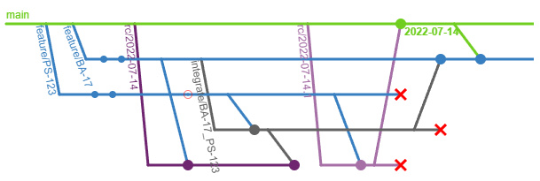

export { components } from '@/components/mdx/components.astro';

# FAQ's for the Scalable Git Branching Model

## What are the scalable git branching model gotchas?

The following situations are ones we have found developers need to unlearn
habits from other workflows:

- [Creating a new feature branch](#how-do-i-make-a-new-feature-branch)
- [Fixing a bug](#how-do-i-fix-a-bug)
- [Resolving merge conflicts with a release candidate](#how-do-i-resolve-merge-conflicts-with-a-release-candidate)
- [Post-release steps](#how-do-i-make-sure-my-branch-doesnt-get-stale)

## Is there tooling support?

You can find [tools to support many developer workflows on GitHub][git-tools]

## How do I make a new feature branch?

Using the [scalable git branching tools][git-tools], run the following command:

```sh
git new <branch-name>
```

If you're making a branch that depends on another branch (because it needs code
from that branch to release, such as a reusable component, a prior step to a
workflow, build infrastructure improvments, etc.), you can specify alternate
sources using the following:

```sh
git new <branch-name> -upstreamBranches <source-1>,<source-2>
```

If your team is not using the git tools, you should use the following:

```sh
git checkout -b <branch-name> origin/main
# Then merge in any additional upstream branches manually
```

## How do I fix a bug?

If your bug is on a feature branch, fix it in the feature branch. If it is in a
service line (such as `main` because it was already released to production),
create a feature branch or a hotfix branch off of that service line. If your bug
is found in a release candidate branch, you should see if it is reproducible in
a feature branch and fix it there. Otherwise, it may be an integration between
two branches due to an incorrect merge; these situations are rare, but it is
important to fix it in an integration branch.

## How do I make sure my branch doesn't get stale?

[Integrating branches with released code is critical in keeping merge pain
low.][FrequencyReducesDifficulty] You should run the following regularly (at
least every day, but each time you reach a stopping point) on your branch:

```sh
git pull-upstream
```

If your team is not using the tools, you must merge upstream branches manually.
Please note that you should follow the heirarchy: don't merge `main` into a
feature branch that used an infrastructure branch. Instead, merge `main` into
the infrastructure branch, then merge the infrastructure branch into the feature
branch.

## Why do I see conflicts that have been resolved before when merging base branches?

This can happen for a few reasons, but the most common is that the integration
branches haven't been re-used.

If all but one of the base branches of an integration branch is merged to your
service line (like `main`), the integration branch may be merged into its other
base. This will resolve merge conflicts between the released features and the
unreleased features without needing to re-do the conflict resolution.

In the diagram below, if we have `feature/PS-123` and `feature/BA-17` that
conflict, we would make an integration branch called `integrate/BA-17_PS-123`.
In this case, `feature/BA-17` gets deferred to a later release, and
`feature/PS-123` is deployed and merged back to the service line `main`. Before
merging `main` into `feature/BA-17`, we should merge `integrate/BA-17_PS-123`
into `feature/BA-17` (after all, we're about to merge `feature/PS-123` in via
`main` anyway, and that's the only thing we have in the integration branch
thanks to the [Isolation until Finalized principle][principle-isolation].) Once
`integrate/BA-17_PS-123` is merged, `main` will merge into `feature/BA-17` much
more cleanly. Also, make sure you remove `integrate/BA-17_PS-123` when you are
done!



Other reasons for resolving the same conflict multiple times include the following:
- Someone on the team did a "revert" commit, then re-did the work (either via
  another "revert", "cherry-pick" or by copying the work by hand.)
- Someone on the team used a rebase merge strategy, which prevents git from
  using history to see that the conflicts are the same.
- The conflict is between a shared branch (like an infrastructure branch) and a
  feature, but an integration branch was not created for re-use.
- An auto-formatter is configured differently for various engineers, which can
  cause nasty conflicts. [Matt DeKrey wrote an article a while back that
  explains how to auto-refactor a project in git with a large number of
  branches.][dekrey-autorefactoring]

## How do I add a dependency to my branch?

If your branch is checked out, run the following:

```sh
git add-upstream <new-source>
```

If your team is not using the git tools, merge the source directly into your
branch and be sure to continue to merge it frequently into your own branch to
ensure you're using the latest, because [frequency reduces difficulty][FrequencyReducesDifficulty].

## How do I resolve merge conflicts with a release candidate?

Because of the [Isolation until Finalized principle][principle-isolation], we do
not merge release candidates into a feature branch. Instead, we need to find the
conflicting branch and create an integration branch.

To find the conflicting branch, you may use commands similar to the following:

```sh
git log origin/rc -- path/to/file.ts
git name-rev <result-of-last-command>
```

This will give a readable name containing the branch where the file was last
modified on the release candidate branch. This is likely where the conflict
occurred.

Once you know the other branch in the RC that caused the conflict, create a new
"integration" branch between your branch and the other one, and resolve
conflicts there. This third branch may be merged into the RC cleanly. (We still
recommend PR reviewers use the original PR, otherwise most online tools show
changes from both branches.)

## What do I do if my branch conflicts with multiple others?

In this case, you should be asking why multiple branches are conflicting with
each other; this is usually a code smell of poor architecture and should be
addressed with refactoring. However, that doesn't help your current situation.

In these cases, an integration branch with multiple integration branches should
be made. Try to create pairs of branches to integrate for any two that may be
released separately from each other, but then merge the resulting integration
branches together. You will see some of the same conflicts come up a second time
in the integration-of-integration-branches, but that is to be expected in this
case.

Please raise this up to technical leadership on your project so this can be
addressed for the future!

## How do I pick a workflow?

The best workflow for your team depends on your team's structure and
requirements. Components in the Scalable Git Branching Model are intended to
be optional, so the following questions will help you build your workflow.

Do you deploy individual features, or do you use a release train or per-sprint
release strategy?

- If you deploy individual features, omit release candidates and hot fixes; your
  feature branches are your release candidates. You also likely won't need integration branches.
- If you intend to bundle multiple features into a single release, use release
  candidate branches.

Do you have a single deployed version (such as a website) or do you maintain
older releases (such as an application or library)?

- If you have a single deployed version, use a single service line, typically
  called `main`.
- If you have multiple released versions, use multiple service lines. If using
  semver, we recommend naming the service line branches `line/<major>.<minor>`,
  tagging patch versions, and setting your repo's default branch to the latest service line.

{/*
Do you have variable hosted development environments (such as created via a PR-opened GitHub workflow) or do you have a specified number of hosted development environments?

- If you have a specific number of hosted development environments, create an
  "environment" branch that is reset to match the code to be deployed.
*/}

Other branch types (like hotfixes, infrastructure branches, and integration
branches) are used on an as-needed basis, and can be easily added to any
workflow by updating documentation.

[git-tools]: https://github.com/PrincipleStudios/scalable-git-branching-tools
[FrequencyReducesDifficulty]: https://martinfowler.com/bliki/FrequencyReducesDifficulty.html
[principle-isolation]: https://principlestudios.com/article/a-scalable-git-branching-model/#isolation-until-finalized
[dekrey-autorefactoring]: https://dekrey.net/articles/automated-git-refactorings/
